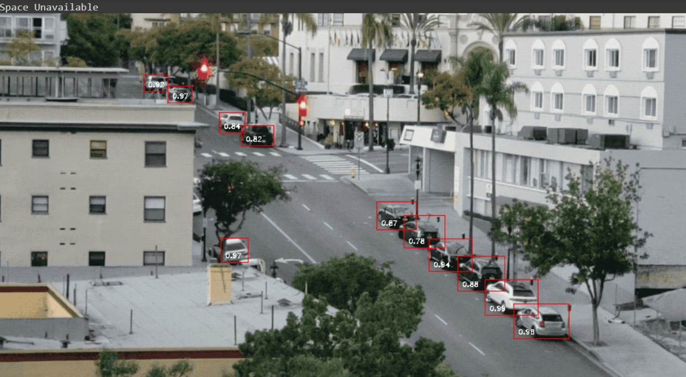
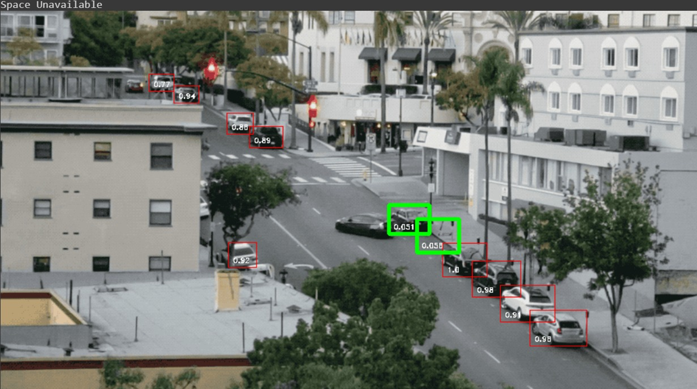

# Eazy_Park
Fast &amp; Efficient parking for users using Object Detection (Masked R-CNN)

The dataset used in this model is COCO Model (Common Objects in Context). COCO model helps in recognising 80 different types of objects.

A confidence score of the object detection is given. The higher the number, the more certain the model is that it correctly identifies the object.

The bounding box of the object in the image, given as X/Y pixel locations (Intersection over union) (IoU).

A bitmap “mask” that tells which pixels within the bounding box are part of the object and which aren’t. With the mask data, we can also work out the outline of the object.

INITIAL STAGE: 

FINAL STAGE:

This was a project made by the team (coding_capitals3):
                                    1. Vandit Gupta
                                    2. Akshit Diwan
                                    3. Karan Garg
                                    
for the hackathon : Student Hackday|2019|Delhi by Skillenza

  
